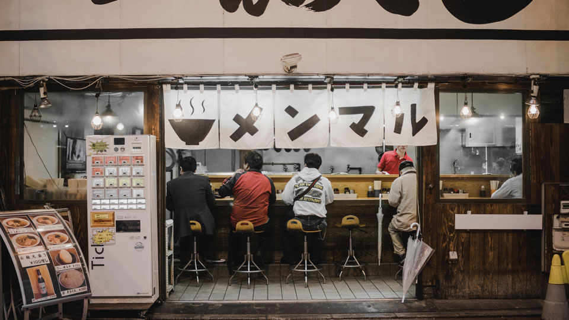

## Ramen Shop

# Japanese Shoyu Ramen

Ramen is a very essential food item in Japan. The word 'Shoyu' in Japan means soy sauce. The broth has a transparent, brown color due to the soy sauce and the ramen itself is a piece of art made by the Japanese. The chef takes their most delicious and expensive ingredients to make a premium dish. Here is how you could make one at home. 

## The Ingredients

Kombu Dashi and Tare (Broth)
1. sugar
2. 2 tbsp reduced-sodium soy sauce  
3. 1/2 tsp kosher salt
4. 1/4 tsp MSG
5. mirin

Noodles and Garnishes
1. 3 large eggs
2. 6 5-oz. packages fresh thin and wavy ramen noodles (or six 3-oz. packages dried)
3. 1/2 cup menma (fermented bamboo shoots)
4. 6 scallions, thinly sliced
5. 3 toasted nori sheets, torn in half
6. Chili oil, toasted sesame oil, and shichimi togarashi (for serving)

### Making the Ramen

First, take everything is the Kombu Dashi and Tare section and mix them all together in a bowl. Once you have finished mixing, take your pack of ramen and eggs and set it on boil. The next thing to do it to take a large bowl, put everything into the bowl, and use the hot water to mix it with the broth mix. And fianlly, add seaweed for the final touches.

[Shoyu Noodle Recipe](https://www.bonappetit.com/recipe/shoyu-ramen)
